# 🎓 Student Attendance System

A full-stack web application for managing B.Tech student attendance. It provides real-time code-based attendance, timetable management, and role-specific dashboards for Admins, Teachers, and Students.

---


## ✨ Features

- 🔐 Secure login with JWT authentication
- 🧑‍🏫 Admin dashboard to manage teachers, students, sections, and timetables
- ⏰ Teachers generate real-time attendance codes
- 📥 Students mark attendance using unique codes
- 📊 Manual and auto attendance modes
- 📆 Weekly timetable for teachers and students
- 📌 Attendance request management

---

## 🧑‍💻 Tech Stack

| Layer     | Technology                |
|-----------|---------------------------|
| Frontend  | React.js (Vite) + Bootstrap |
| Backend   | Node.js + Express.js      |
| Database  | MongoDB                   |
| Auth      | JWT (Token-based)         |

---

## 🖼️ Screenshots

### 🔐 Login


### 🛠️ Admin Dashboard
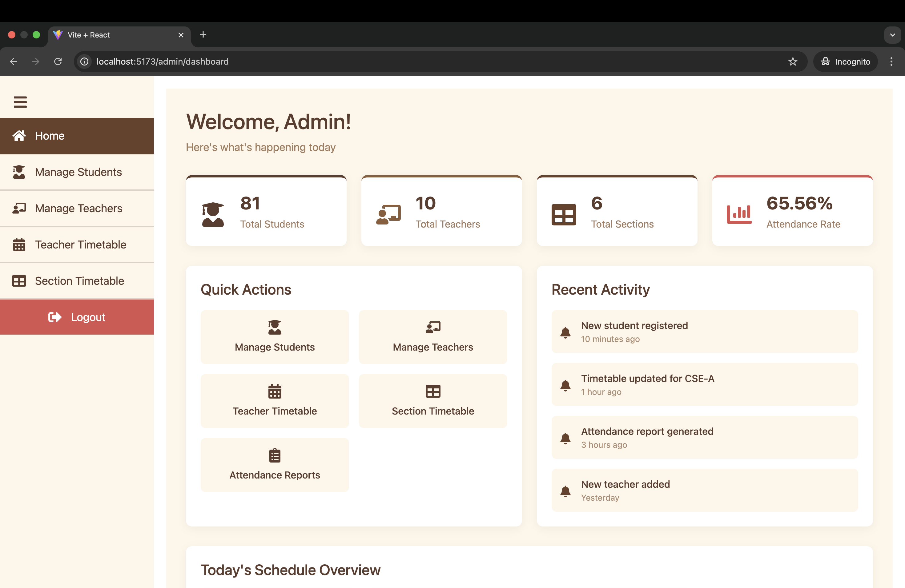

### 👩‍🏫 Manage Teachers & Students
| Manage Teachers | Manage Students |
|-----------------|-----------------|
| 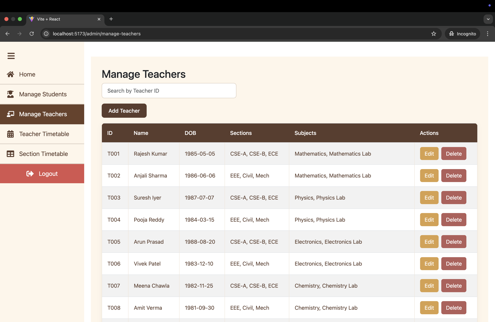 | 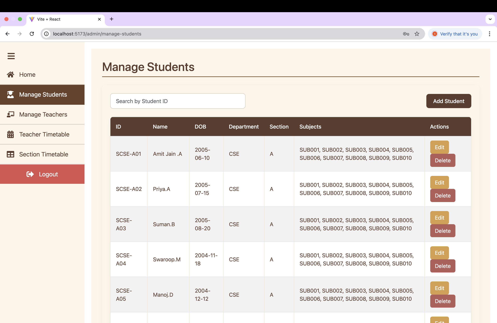 |

### 🧩 Manage Sections & Timetables
| Sections | Timetables |
|----------|------------|
| 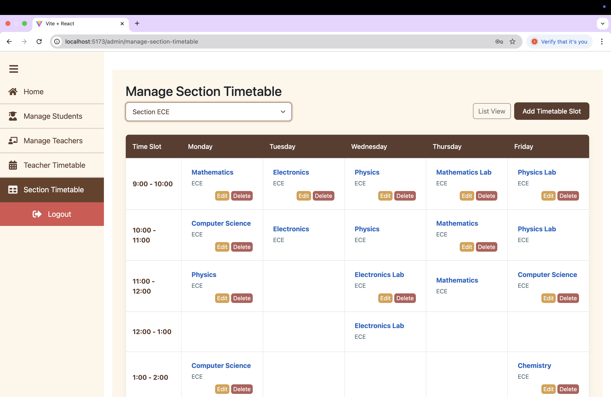 | 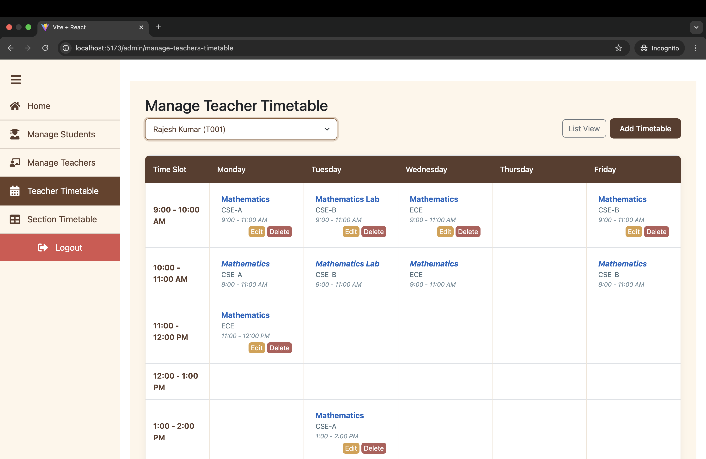 |

### 🧾 Manual Attendance
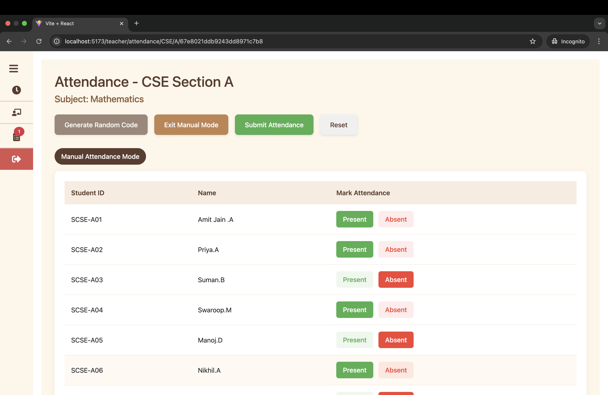

### 🔐 Random Code Attendance
| Teacher Side | Student Side |
|--------------|---------------|
| 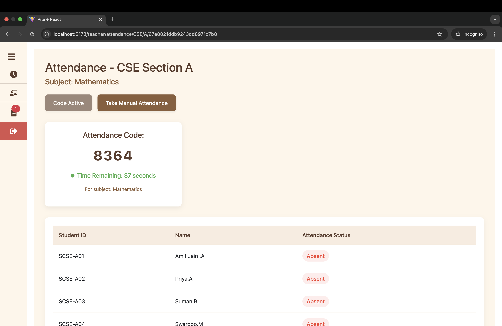 | 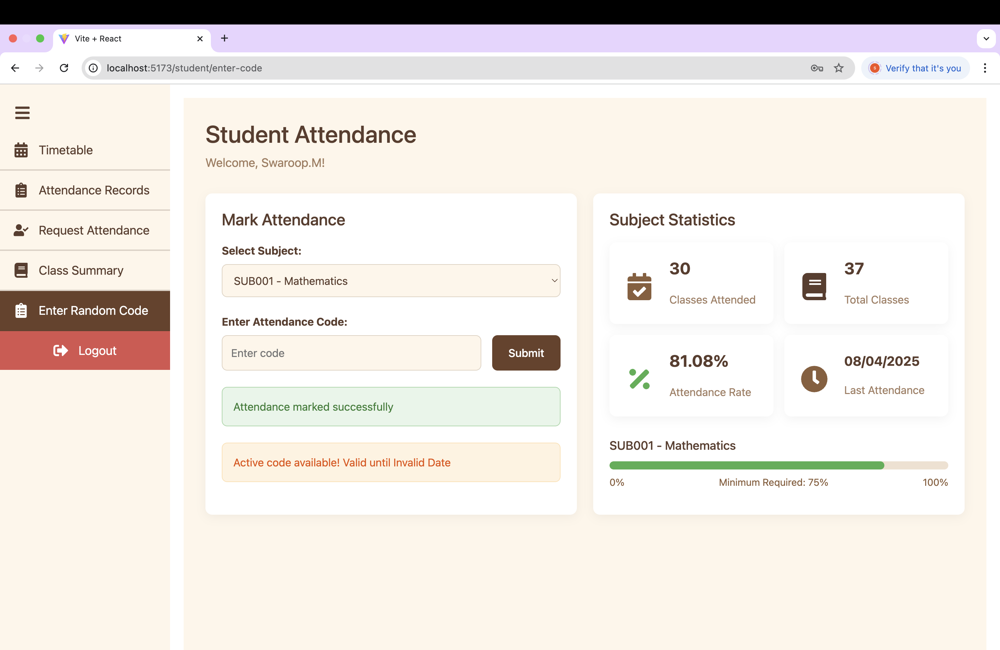 |

### 📑 View & Request Attendance
| View Attendance | Request Attendance |
|------------------|--------------------|
| 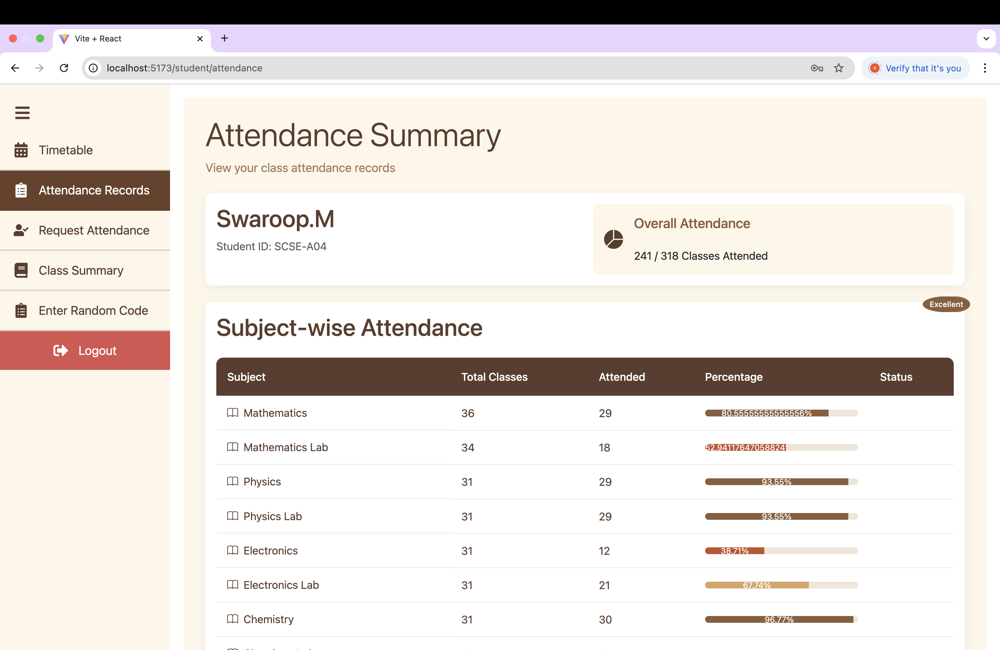 | 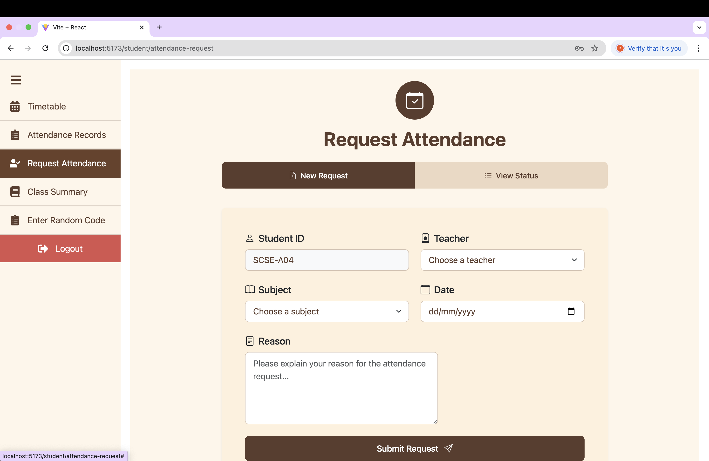 |

### ✅ Attendance Summary & Request Status
| Summary | Status |
|---------|--------|
| 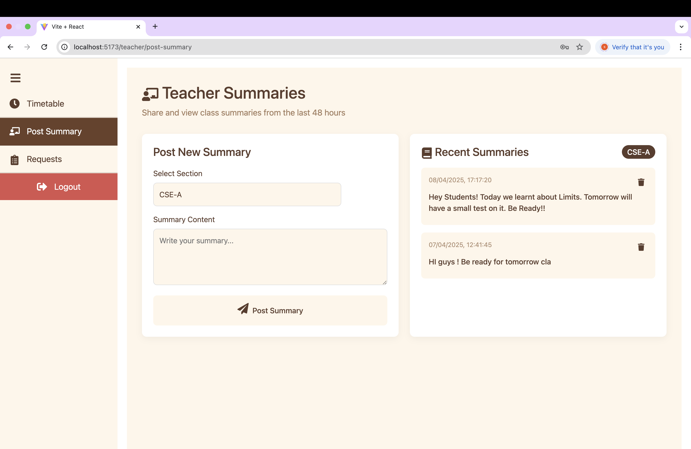 | 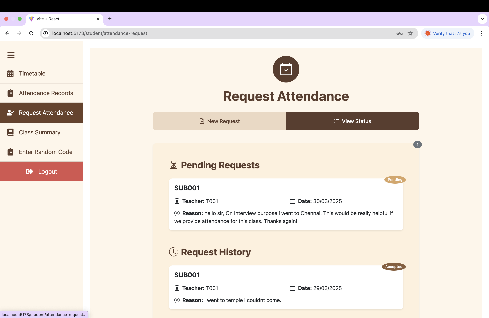 |

---

## 📁 Folder Structure

```
attendance/
├── frontend/        # React + Vite client app
├── backend/         # Express backend APIs
```

---

## 🚀 Getting Started

### 1. Clone the repository

```bash
git clone https://github.com/<your-username>/attendance.git
cd attendance
```

---

### 2. Setup Backend

```bash
cd backend
npm install
```

#### 📄 Create `.env` file

```env
PORT=5000
MONGO_URI=mongodb+srv://<username>:<password>@cluster.mongodb.net/attendance
JWT_SECRET=your_jwt_secret
```

#### ▶️ Run the Server

```bash
node server.js
```

---

### 3. Setup Frontend

```bash
cd ../frontend
npm install
npm run dev
```

---

## 🌱 Seeding the Database

Initial data includes admins, teachers, students, subjects, and timetable entries.

### ✅ Steps to Seed

1. Open `backend/SeedDatabase.js`
2. Uncomment all the code (seed logic is initially commented out for safety)
3. Run:

```bash
node SeedDatabase.js
```

4. Re-comment or delete the script after successful seeding.

---

## 🎯 Future Enhancements

- 📈 Admin analytics dashboard
- 📩 Email notifications for attendance
- 📲 Mobile app (React Native or Flutter)
- 📥 CSV & Excel export options
- ⌛ Attendance history by date range

---

## 👩‍💻 Developed By

**Sri Vyshnavi Gadamsetty** and team  
Made with ❤️ from Vijayawada

---
